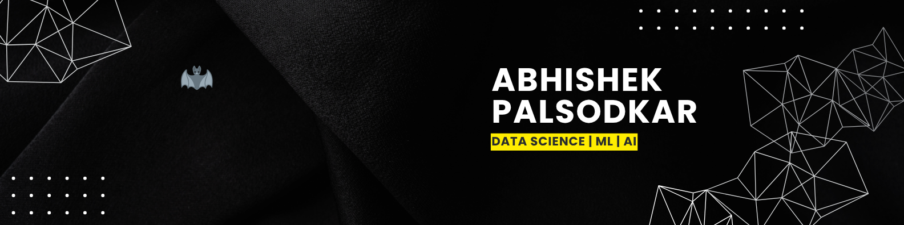

<!-- 🦇 BATMAN LOGO -->

  

<!-- 🎬 BANNER -->

  

<!-- ⌨️ TYPING HEADER -->

  

---

## 👨‍💻 About Me

I'm **Abhishek Palsodkar**, a Data Science enthusiast and Data Analysis aspirant focused on building intelligent, real-world solutions using modern data science tools and AI technologies to drive innovation.

My work revolves around Machine Learning and AI-based automation — using predictive modeling, pattern recognition, and ML algorithms to uncover insights and improve decision-making.  
I also specialize in building interactive dashboards and pipelines with a strong foundation in clean, production-ready Python development.

**My current focus is on:**
- Applying ML algorithms to extract patterns, predict outcomes, and support business strategy  
- Automating end-to-end data workflows to reduce manual effort and improve scalability  
- Designing scalable AI solutions using LangChain and OpenAI APIs  
- Creating powerful data visualizations for business intelligence  
- Deploying ML workflows that solve real user problems in production environments

---

## 🧰 Tech Stack

### 🚀 Languages  
  
  
  
  

### 📊 Data Science & Machine Learning  
  
  
  
  
  

### 🧠 NLP & AI  
  
  
  
  
  

### 📈 Visualization & BI  
  
  
  
  

### ⚙️ App Development & Deployment  
  
  

### 🔧 Version Control & CI/CD  
  
  
  

### 💻 Environments & IDEs  
  
  
  

