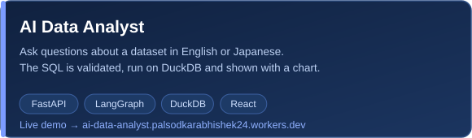
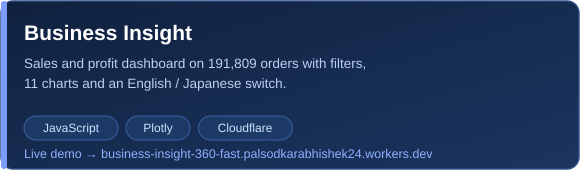
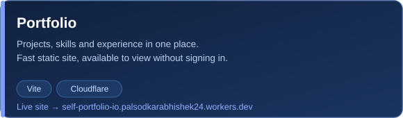

  

  

  
  
  
  

## About

I am a data scientist with a Master's in Data Science from the University of Arizona and about 1.5 years of internship experience in data science and analytics. I build dashboards, machine learning models and small applications that turn raw data into answers people can use.

I am looking for data science and ML / AI roles in Japan.

日本での就業を希望しており、データサイエンス・機械学習・AI分野の職種を探しています。ポートフォリオと各プロジェクトは日本語表示にも対応しています。

## Projects

Each demo opens without signing in. The AI Data Analyst backend and the Streamlit apps run on free hosting, so the first visit after a quiet period can take up to a minute to wake up.

<table>
  <tr>
    <td></td>
    <td></td>
  </tr>
  <tr>
    <td></td>
    <td></td>
  </tr>
  <tr>
    <td colspan="2" align="center"></td>
  </tr>
</table>

Source code: [ai-data-analyst](https://github.com/Abhishek24122000/ai-data-analyst) · [business-insight-360-fast](https://github.com/Abhishek24122000/business-insight-360-fast) · [Healthcare-Premium-Prediction](https://github.com/Abhishek24122000/Healthcare-Premium-Prediction) · [Cold_Email_Generator](https://github.com/Abhishek24122000/Cold_Email_Generator) · [SELF_PORTFOLIO.IO](https://github.com/Abhishek24122000/SELF_PORTFOLIO.IO)

## Skills

| | |
|---|---|
| **Languages** |     |
| **Data and ML** |      |
| **BI and visualization** |      |
| **LLM applications** |     |
| **Apps and cloud** |       |
| **Tools** |     |

## Education and certifications

| | |
|---|---|
| **Education** | M.S. Data Science, University of Arizona Bachelor of Computer Applications, MIT World Peace University, Pune |
| **Certifications** | AWS Certified Solutions Architect – Associate AWS Certified Cloud Practitioner Google Advanced Data Analytics Professional Certificate Microsoft Certified: Power BI Data Analyst (PL-300) |

## GitHub activity

  
  

  

  

